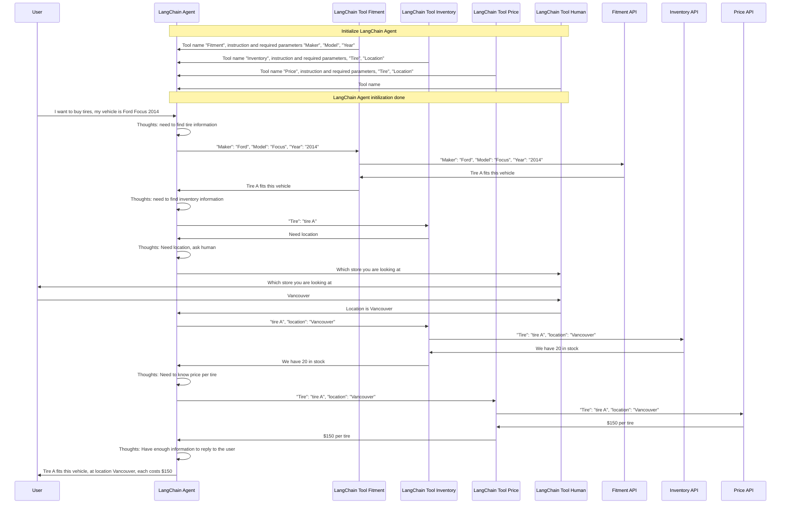

```mermaid
sequenceDiagram
    participant User
    participant LangChain Agent
    participant LangChain Tool Fitment
    participant LangChain Tool Inventory
    participant LangChain Tool Price
    participant LangChain Tool Human

    participant Fitment API
    participant Inventory API
    participant Price API
    
    Note over LangChain Agent, LangChain Tool Human: Initialize LangChain Agent
    LangChain Tool Fitment->>LangChain Agent: Tool name "Fitment", instruction and required parameters "Maker", "Model", "Year"
    LangChain Tool Inventory->>LangChain Agent: Tool name "Inventory", instruction and required parameters, "Tire", "Location"
    LangChain Tool Price->>LangChain Agent: Tool name "Price", instruction and required parameters, "Tire", "Location"
    LangChain Tool Human->>LangChain Agent: Tool name
    Note over LangChain Agent,LangChain Tool Human: LangChain Agent initilization done

    User->> LangChain Agent: I want to buy tires, my vehicle is Ford Focus 2014
   
    LangChain Agent ->> LangChain Agent: Thoughts: need to find tire information
    LangChain Agent ->> LangChain Tool Fitment: "Maker": "Ford", "Model": "Focus", "Year": "2014"
    LangChain Tool Fitment ->> Fitment API: "Maker": "Ford", "Model": "Focus", "Year": "2014"
    Fitment API ->> LangChain Tool Fitment: Tire A fits this vehicle
    LangChain Tool Fitment ->> LangChain Agent: Tire A fits this vehicle

    LangChain Agent ->> LangChain Agent: Thoughts: need to find inventory information
    LangChain Agent ->> LangChain Tool Inventory: "Tire": "tire A"
    LangChain Tool Inventory ->> LangChain Agent: Need location

    LangChain Agent ->> LangChain Agent: Thoughts: Need location, ask human
    LangChain Agent ->> LangChain Tool Human: Which store you are looking at
    LangChain Tool Human ->> User: Which store you are looking at
    User ->> LangChain Tool Human: Vancouver
    LangChain Tool Human ->> LangChain Agent: Location is Vancouver

    LangChain Agent ->> LangChain Tool Inventory: "tire A", "location": "Vancouver"
    LangChain Tool Inventory ->> Inventory API: "Tire": "tire A", "location": "Vancouver"
    Inventory API ->> LangChain Tool Inventory: We have 20 in stock
    LangChain Tool Inventory ->> LangChain Agent: We have 20 in stock

    LangChain Agent ->> LangChain Agent: Thoughts: Need to know price per tire
    LangChain Agent ->> LangChain Tool Price: "Tire": "tire A", "location": "Vancouver"
    LangChain Tool Price ->> Price API: "Tire": "tire A", "location": "Vancouver"
    Price API ->> LangChain Tool Price: $150 per tire
    LangChain Tool Price ->> LangChain Agent: $150 per tire

    LangChain Agent ->> LangChain Agent: Thoughts: Have enough information to reply to the user
    LangChain Agent ->> User: Tire A fits this vehicle, at location Vancouver, each costs $150    
```