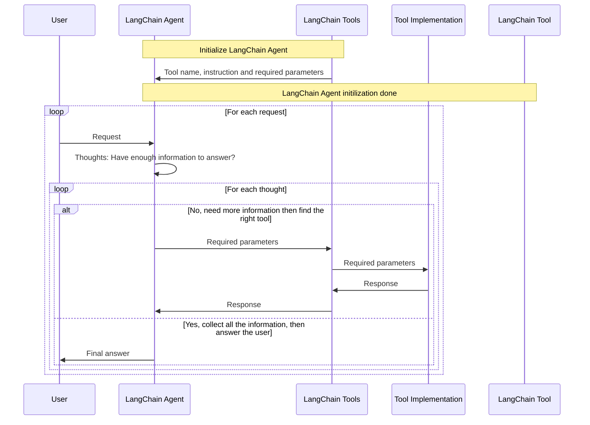

```mermaid
sequenceDiagram
    participant User
    participant LangChain Agent
    participant LangChain Tools

    participant Tool Implementation
    
    Note over LangChain Agent, LangChain Tools: Initialize LangChain Agent
    LangChain Tools->>LangChain Agent: Tool name, instruction and required parameters
    Note over LangChain Agent,LangChain Tool: LangChain Agent initilization done

    Loop For each request
    User->> LangChain Agent: Request
   
    LangChain Agent ->> LangChain Agent: Thoughts: Have enough information to answer?
    
        Loop For each thought
            Alt No, need more information then find the right tool
                LangChain Agent ->> LangChain Tools: Required parameters
                LangChain Tools ->> Tool Implementation: Required parameters
                Tool Implementation ->> LangChain Tools: Response
                LangChain Tools ->> LangChain Agent: Response
            Else Yes, collect all the information, then answer the user 
                LangChain Agent ->> User: Final answer
            End
        End
    End
```